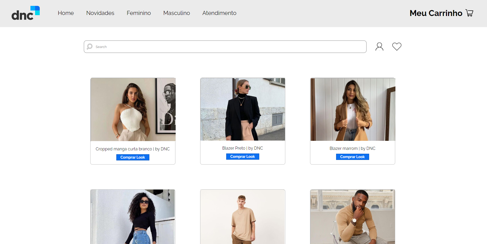

# Projeto de E-Commerce em React 💻
Este é um projeto de comércio eletrônico desenvolvido em React, que visa fornecer uma experiência de compra on-line intuitiva e flexível. O projeto inclui funcionalidades de rotas dinâmicas, componentes reutilizáveis, estilização com SCSS e dados mock para simular um ambiente de e-commerce.

## Recursos 

- Rotas Dinâmicas: Utilização do React Router para criar rotas dinâmicas que permitem navegar facilmente entre diferentes páginas do site. Isso proporciona uma experiência de usuário suave e intuitiva.

- Componentes Reutilizáveis: O projeto é organizado em componentes reutilizáveis que podem ser facilmente integrados em várias partes do site. Isso facilita a manutenção e a expansão do projeto.

- Estilização com SCSS:  Utilização do pré-processador SCSS para criar estilos flexíveis e reutilizáveis. Isso permite uma personalização fácil e consistente da aparência do site.

- Dados Mock:  Para simplificar o desenvolvimento e testes, foi utilizado dados mock que simulam produtos, categorias, pedidos e outros aspectos de um site de comércio eletrônico.

## Instalação e Uso

- Clone o repositório: <i>git clone</i> https://github.com/kauanabalena/ecommerce-dnc.git

- Instale as dependências: <i>npm install</i>

- Execute o projeto: <i>npm start</i>

O projeto estará disponível em http://localhost:3000.

## Contribuições
Contribuições são bem-vindas! Se você deseja contribuir para este projeto, siga estas etapas:

- Fork o repositório
- Crie uma branch com sua feature: <i>git checkout -b minha-feature</i>
- Faça commit das suas mudanças: <i>git commit -m 'Adicione minha feature'</i>
- Envie as mudanças para o seu fork: <i>git push origin minha-feature</i>
- Abra um Pull Request neste repositório